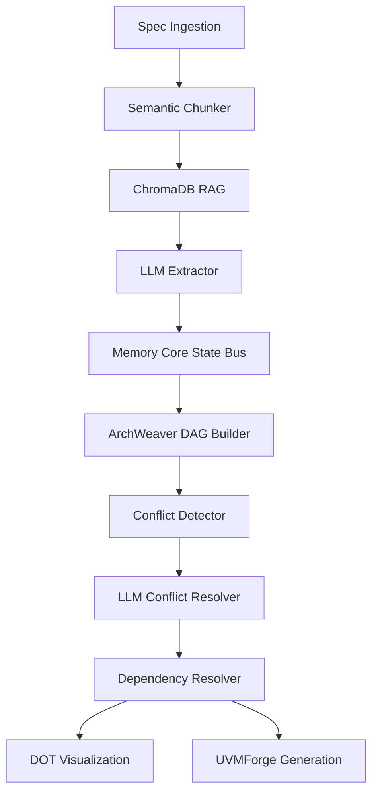

# VeriGenX Architecture Specification

This document details the software architecture and module relationships of **VeriGenX**.

## Core Modules

### 1. SpecMind (Specification Intelligence)
- **Document Ingestor**: Converts PDF, DOCX, TXT, IP-XACT, and SystemRDL inputs into standardized text chunks, using file hashes to skip redundant processing.
- **Semantic Chunker**: Word-boundary aware chunking with tunable overlap size.
- **ChromaDB Embedder**: Leverages local Ollama `nomic-embed-text` embeddings for persistent retrieval-augmented semantic search.
- **LLM Extractor**: Queries local LLM to extract signals, states, registers, timing constraints, handshake rules, and firmware models.

### 2. ArchWeaver (Dependency Graph Engine)
- **DAG Builder**: Translates JSON test plans into component nodes and edge collections.
- **Conflict Detector**: Evaluates duplicate component names, signals, and checks for interface width/direction alignment.
- **LLM Conflict Resolver**: Incorporates DAG topology and topological generation sequences to resolve conflicts and cycles.
- **Resolver**: Performs topological sorting using Kahn's algorithm and outputs the compilation order.

### 3. Memory Core State Bus
- Centralized `StateBus` singleton tracking in-memory pipeline parameters to coordinate downstream processing phases.
